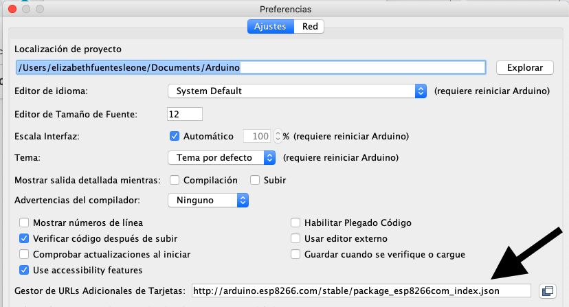
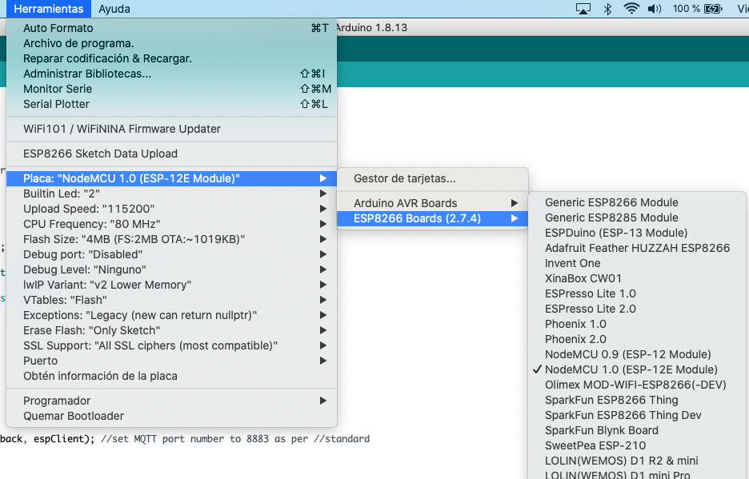

# Como instalar el controlador para el NodeMCU ESP8266 en Arduino

- Ingresa a preferencias y en **"Gestor de URLs Adicionales de Tarjetas"** copia el siguiente link: 

http://arduino.esp8266.com/stable/package_esp8266com_index.json

- Presiona **OK**. 

- Al finalizar deberias poder ver lo siguiente en el menú de herramientas: 

## Y eso seria todo ;)

