# Iniciando AWS IoT
# Conectando NodeMCU con AWS IoT

En este repositorio vamos a aprender los primeros pasos para integrarnos a mundo de AWS IoT. 


Para conocer las ventajas y caracteristicas del mundo AWS IoT te inivito a visitar el siguiente link: [https://aws.amazon.com/es/iot/](https://aws.amazon.com/es/iot/)


Este tutorial consiste en tres ejercicios, un primer ejercicio donde simularemos un dispositivo utilizando un programa simple en Python y otro usando un dispositivo real NodeMCU ESP8266, ambos para enviar mensajes a la nube AWS IoT Core, y en el ultimo ejercicio cofiguraremos algunas acciones en AWS IoT gatilladas con los mensajes enviados. 

---
---

## AWS IoT Core 


AWS IoT Core es un servicio en la nube administrado que permite a los dispositivos conectados interactuar de manera fácil y segura con las aplicaciones en la nube y otros dispositivos.


[Conoce más sobre AWS IoT Core](https://aws.amazon.com/es/iot-core/?nc=sn&loc=2&dn=3)

---
---

## Ejercicio 1: Enviar mensajes MQTT a AWS IoT Core desde Python. 

En este ejercicio, vamos a configurar un objeto de IoT en AWS IoT Core; una vez que tenga esa configuración, ejecutaremos un pequeño programa para simular el envío de datos a AWS IoT Core y luego usará el cliente de prueba MQTT para ver la carga útil de cada mensaje MQTT.

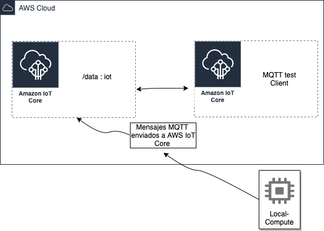

¿Que necesitas?

- [x] Una cuenta AWS. [Crea tu cuenta con capa gratuita](https://aws.amazon.com/es/free/?all-free-tier.sort-by=item.additionalFields.SortRank&all-free-tier.sort-order=asc)
- [x] Conocimientos en Python.
- [x] Configurada tus credenciales de acceso de la cuenta AWS. [Aca como lo puedes hacer](https://docs.aws.amazon.com/es_es/cli/latest/userguide/install-cliv2.html)

---

### Parte 1: Crear el objeto en AWS IoT Core.


Ir al servicio AWS IoT Core


En el siguiente menú seleccionar Click a **"Crear solo un objeto"**

Para este ejercicio le colocaremos el nombre de **objeto1** y le damos Click a **"Siguiente"**

En el siguiente paso debes darle Click a **"Crear Certificado"**

El certificado es único por objeto y es la forma segura de interactuar con los servicios de AWS IoT desde los dispositivos, esta debe ser grabada como una clave privada en la memoria de los dispositivos al momento de su programación para que nunca se transfiera a través de Internet junto con las solicitudes, lo que significa una gran ventaja de seguridad.


 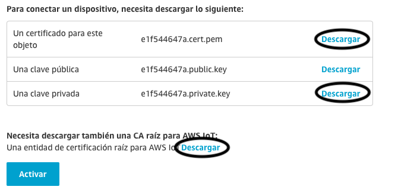

 Descargue el certificado y la clave privada para el dispositivo, y también el rootCA 1 . 


- Duplica el archivo de certificado con el siguiente nombre **certificate.pem**
- Duplica el archivo de privateKey con el siguiente nombre **privateKey.pem**
- Duplica el archivo de rootCA 1 con el siguiente nombre **rootCA.pem**

 Asegurate de presionar el botón de **"Activar"** para que se pueda usar el certificado. 


Finaliza el proceso haciendo clic en el botón **"Listo"**. 

El siguiente punto es crear y adjuntar una política al certificado, que autorice al dispositivo autenticado a realizar acciones de IoT en los recursos de AWS IoT.

Para crear la política debes ir al menú del lado izquierdo **Seguridad -> Políticas** una vez ahí debes darle Click a **"Crear una Política"**, para efectos de este ejercicio la nombráremos **objeto1-policity**, completa los campos (Acción, ARN de recurso) con un asterisco **"*"**, esto solo para efectos de este ejercicio, debido a que permite todo, marque la opción Permitir efecto y luego presione el botón **"Crear"**. 

**Nota:** Para un desarrollo en producción real, utilice la definición de política que brinde el mínimo permiso necesario para el funcionamiento del dispositivo (más información: [https://docs.aws.amazon.com/IAM/latest/UserGuide/best-practices.html#grant-least-privilege](https://docs.aws.amazon.com/IAM/latest/UserGuide/best-practices.html#grant-least-privilege))

Ahora en el menú del lado izquierdo **Seguridad > Certificados**, verás el certificado que se creó anteriormente, toque los tres puntos de la derecha y elija **Asociar política**, aparecerá una ventana emergente que muestra sus políticas existentes, selecciona la política creada recientemente y asocia, finaliza el proceso con **”Activar”**. 

**¡¡Esto es todo Felicidades!! ya has creado tu primer objeto de AWS IoT con éxito, le has generado un certificado y le has adjuntado una política.**

---

### Parte 2: Simular un dispositivo con un programa en python.

El programa para eete ejercicio esta en [ejercicio1.py](https://github.com/elizabethfuentes12/Iniciando_AWS_IoT/blob/master/ejercicio1.py), en la misma carpeta donde dejes el programa deben estar los archivos que renombramos en la parte anterior. 

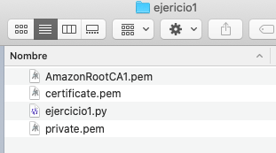

Para que el programa funcione debes modificar lo siguiente: 

- [x] Asegurate de tener configurada tus credenciales de acceso de la cuenta AWS en tu computador. [Aca como lo puedes hacer](https://docs.aws.amazon.com/es_es/cli/latest/userguide/install-cliv2.html)

- [x] Tener instalada la libreria AWSIoTPythonSDK:
```
pip install AWSIoTPythonSDK
```

- [x] En AWS Iot Core ve al menu de abajo a la izquierda **"Coniguración -> Punto de enlace"** y copias y pegas aca el link que aparece en la siguiente linea reemplazando a "data.iot.us-west-2.amazonaws.com":
```
mqttc.configureEndpoint("data.iot.us-west-2.amazonaws.com",8883)
```
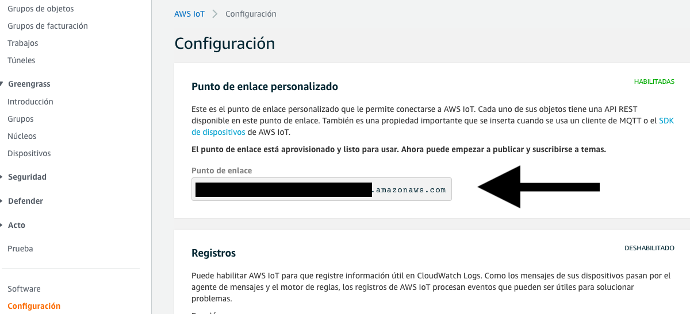

- [x] Debes asegurarte de que el nombre de tus certificados tenga los nombres de la siguiente línea a continuación y además que estén en la misma carpeta.  

```
mqttc.configureCredentials("./rootCA.pem","./privateKey.pem","./certificate.pem")
```

Configura el ambiente de AWS IoT para ver los datos antes de activar el programa: 

Ve al menú de abajo a la izquierda **"Prueba"** y en **Publicar** especifica el mensaje, para nuestro caso de llama **"data"**, como en el código a continuación:

```
mqttc.publish("data", message, 0)
```

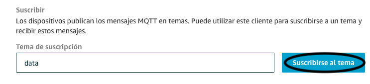

Finalizas dando click a **"Suscribirse al tema"**

Ahora ejecuta el programa 

```
python ejercicio1.py
```

y si todo esta OK podrias empezar a ver los mensjes enviados:

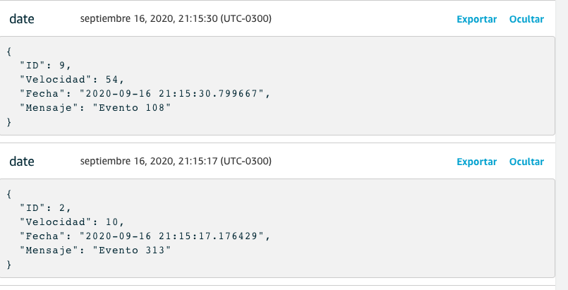

Para cancelar la ejecucion debes presionar **"ctrl + c"**

---
---

## Ejercicio 2: Enviar mensajes MQTT a AWS IoT Core desde NodeMCU ESP8266.

En este ejercicio usaremos el mismo objeto creado en el paso anterior para enviar mensajes desde un NodeMCU ESP8266 a AWS IoT Core. 

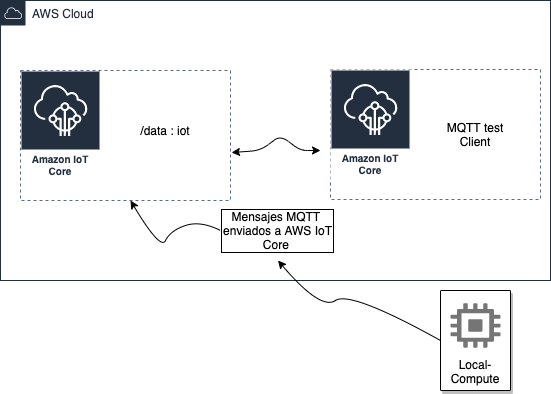

¿Que necesitas?

- [x] Una cuenta AWS. [Crea tu cuenta con capa gratuita](https://aws.amazon.com/es/free/?all-free-tier.sort-by=item.additionalFields.SortRank&all-free-tier.sort-order=asc)
- [x] Un NodeMCU ESP8266. Disponible en cualquier tienda on-line [ejemplo](https://www.amazon.com/-/es/Internet-desarrollo-inalámbrico-funciona-Micropython/dp/B07R4MVSCY/ref=sr_1_6?__mk_es_US=ÅMÅŽÕÑ&dchild=1&keywords=NodeMCU+ESP8266&qid=1600307883&sr=8-6).
- [x] Tener instalado en tu computador Arduino. [Link de descarga](https://www.arduino.cc/en/main/software)
- [x] Tener instalado en tu computador OpenSSL. [Link de como hacerlo](https://github.com/elizabethfuentes12/Iniciando_AWS_IoT/blob/master/instalarOpenSSL.md)

Puedes conocer un poco mas de NodeMCU en su [Datasheet](hhttps://www.esploradores.com/datasheet-nodemcu/)

---

### Parte 1: Convertir los certificados a DER. 

Hay dos métodos principales para codificar los datos del certificado.

**DER** = Codificación binaria para datos de certificado.
**PEM** = Codificación base64 del certificado codificado en DER, con líneas de encabezado y pie de página agregadas.


**DER**: ("Distinguished Encoding Rules" - Reglas de codificación distinguidas) es un subconjunto de la codificación BER que proporciona exactamente una forma de codificar un valor ASN.1. DER está diseñado para situaciones en las que se necesita una codificación única, como en la criptografía, y garantiza que una estructura de datos que debe firmarse digitalmente produzca una representación serializada única.

**PEM**: (“Privacy Enhanced Mail” - correo electrónico con privacidad mejorada) Es uno de los primeros estándares para proteger el correo electrónico (IRTF, IETF). No es mas que un certificado DER codificado en US-ASCII por base64, solicitud de certificado o PKCS # 7, incluido entre delimitadores PEM típicos, es decir, “—– BEGIN CERTIFICATE—–” and “—– END CERTIFICATE—–“. PEM nunca ha sido ampliamente adoptado como estándar de correo de Internet, pero se ha convertido en un estándar básico en x509 pki (también llamado pkix)

Dado que nuestro ESP8266 no comprende la codificación base64, convertiremos los certificados a binario DER. 

Para continuar debes asegurarte de que tengas instalado OpenSSL, para revisar escribe en tu línea de comando:  


```
openssl
```
Si la respuesta es:
```
OpenSSL>
```
Entonces esta instalado y continúa avanzando, de lo contrario revisa como hacerlo en este [Link](https://github.com/elizabethfuentes12/Iniciando_AWS_IoT/blob/master/instalarOpenSSL.md)

Una vez instalado OpenSSL, podremos usarlo para convertir nuestros certificados a DER usando los siguientes comandos en tu terminal: 

```
openssl x509 -in xxxxxxxxxx-certificate.pem.crt -out cert.der -outform DER 
openssl rsa -in xxxxxxxxxx-private.pem.key -out private.der -outform DER
openssl x509 -in AmazonRootCA1.pem -out ca.der -outform DER
```
Reemplaza el "xxxxxxxxxx" con el nombre de tu certificado y AmazonRootCA1 seguirá siendo el mismo si se llama igual de lo contrario debes modificarlo.

Después de ejecutar estos comandos, observa que los certificados se guardan en la misma carpeta con formato .der, copia estos archivos en formato DER en una carpeta que debes llamar **data**.

---

### Parte 2: Instalación de la herramienta para NodeMCU ESP8266 en Arduino IDE.

- Primero aregurate de tener instalado Arduino, de no ser asi [Link de descarga](https://www.arduino.cc/en/main/software). 

- Una vez te asegures de lo anterior debes revisar que tu Arduino tenga el complemento ESP8266 instalado. Si no lo tienes puedes revisar estos dos link para ver como se instala: 

[Controlador NodeMCU ESP8266](https://github.com/elizabethfuentes12/Iniciando_AWS_IoT/blob/master/NodeMCU_ESP8266.md)

[NodeMCU programming with Arduino](https://electronicsinnovation.com/nodemcu-arduinoide/).

- Ahora debemos cargar en Arduino el complemento de ESP8266  que empaqueta los certificados de la carpeta de **data** en la memoria flash de nuestro ESP8266: 

- [x] Descarga la herramienta para pasar los archivos a la memoria del ESP8266 **"ESP8266FS-0.4.0.zip"** [Git hub releases page](https://github.com/esp8266/arduino-esp8266fs-plugin/releases/tag/0.5.0).

- [x] Dentro de la carpeta de Arduino, crea una nueva carpeta con el nombre tools, en el caso de que aún no exista, luego descomprime el **"ESP8266FS-0.4.0.zip"** dentro de ella, se debe ver como <carpeta arduino> /tools/ESP8266FS/tool/esp8266fs.jar).

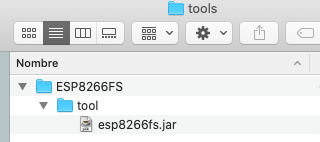

- Para que se pueda realizar la instalación debes asegurare que en preferencia este la carpeta raíz de donde se encuentra tu carpeta tools para que pueda leer el .jar: 


- Reinicia Arduino IDE.
- Ve a "Herramientas" y **"ESP8266 Skerch Data Upload"** estará allí.

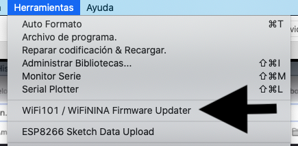

### Creditos de esta herramienta a: Hristo Gochkov.

---

### Parte 3: Descargando el certificado AWS en tu NodeMCU ESP8266.

- En Arduino Crea un nuevo proyecto y salvalo para que te cree una nueva carpeta. 

Para este ejemplo nombre a mi proyecto **"Inicindo_AWS_IoT"**

- Luego pega la carpeta **data** dentro de el:

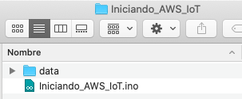

- Conecta el NodeMCU ESP8266 al computador y asegurate que lo tome en el puerto adeduado: 

De esta forma puedes verificar que el dispositivo esta conectado al pc: 

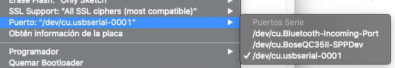


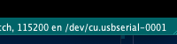

- Configura los siguientes parametros en Herramientas:

**Upload Speed: "115200"**

**Flash Size: "4MB"**

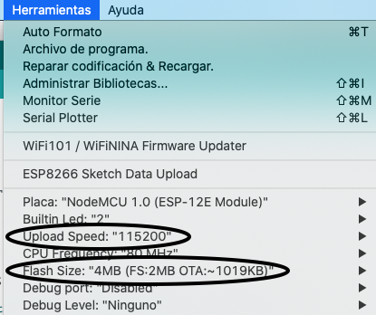

- Ve a **Herramientas>ESP82 Sketch Data Upload** eso dará inicio a la carga de los certificados en el NodeMCU ESP8266, puede tardar un poco no te preocupes. 


Cuando este listo veras lo siguiente: 
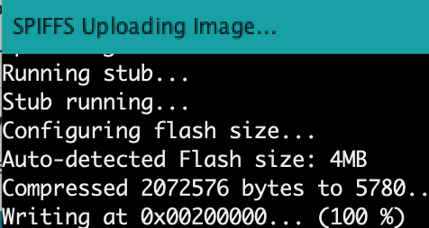

---

### Parte 4: Modificar el código para el NodeMCU ESP8266 al servidor AWS IoT. 


Para que el código funcione debes: 

- Copia el codigo para arduino del siguiente [ejercicio2.txt](https://github.com/elizabethfuentes12/Iniciando_AWS_IoT/blob/master/ejercicio2.txt), este al igual que el anterir se se suscribe al tema **"data"** por lo que no es necesario modficar nada en AWS IoT Core. 

- Pega el código en tu proyecto .ino:


En estas lineas van los datos de WIFI necesarios para que el NodeMCU ESP8266 se pueda conectar y enviar la informacion al servidor AWS IoT
```
const char* ssid ="Electronics_Innovation";
const char* password = "subscribe";
```

También debes cambiar el AWS_endpoint, como en el ejercicio 1,  es la dirección del agente MQTT para tu cuenta AWS IoT Core en la región especifica.

```
const char* AWS_endpoint = "xxxxxxxxxxxxxx-ats.iot.us-west-2.amazonaws.com"; //MQTT broker ip
```


- Asegúrese de que el nombre de los archivos coincida con los nombres de sus certificados reales en la carpeta **data**.

```
line no: 126> File cert = SPIFFS.open("/cert.der", "r"); //replace cert.crt eith your uploaded file name
line no:141 > File private_key = SPIFFS.open("/private.der", "r"); //replace private eith your uploaded file name
line no:158 > File ca = SPIFFS.open("/ca.der", "r"); //replace ca eith your uploaded file name
```
- Debes tener instaladas las siguientes librerias: 
```
#include "FS.h"
#include <ESP8266WiFi.h>
#include <WiFiUdp.h>
#include <PubSubClient.h>
#include <NTPClient.h>
```
Las librerías que no tengas instaladas las puedes instalar de Herramientas > Administrar Bibliotecas. 

También las puedes buscar en google o el buscador de tu preferencia para descargar y las pegas en la carpeta **libraries** que se encuentra dentro de **Arduino**

<NTPClient.h> --> Hice una modficación a la libreria original para que funcionara el comando **getFormattedDate**, la modificación la puedes encontrar dentro del github [libreria/NTPClient](https://github.com/elizabethfuentes12/Iniciando_AWS_IoT/tree/master/libreria/NTPClient)


---
### Parte 5: Compilando y cargando el nuevo programa en NodeMCU ESP8266.

En esta parte vamos a enviar los mismos mensajes que enviamos en el ejercicio 1 pero desde nuestro dispositivo real.


- Compila el programa y si todo esta correcto subelo a tu NodeMCU ESP8266. 

Para compilar: 


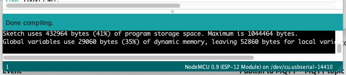

Para subirlo al NodeMCU ESP8266:

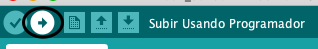

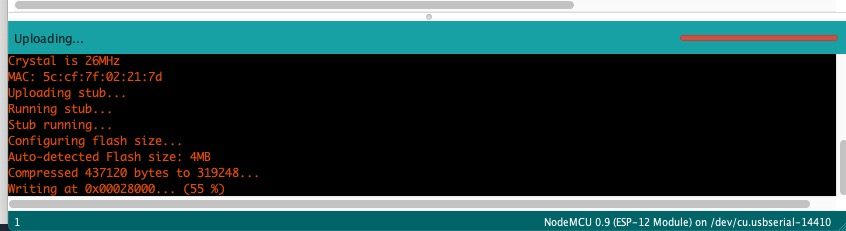


- Ahora seremos capaces de ver los datos enviados en AWS IoT Core como lo hicimos en el ejercicio anterior. 

- En el servicio de AWS IoT Core ve al menu de abajo a la izquierda **"Prueba"** y en Publicar especifica el mensaje que para nuestro caso de llama **"data"**, como lo puedes ver en e codigo. 

```
client.publish("data", msg);
```


Finalizas dandole click a **"Suscribirse al tema"**

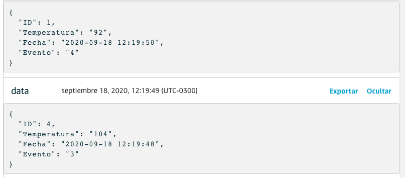

 Tutorial estraido de [How to connect NodeMCU ESP8266 with AWS IoT Core using Arduino IDE & MQTT](https://electronicsinnovation.com/how-to-connect-nodemcu-esp8266-with-aws-iot-core-using-arduino-ide-mqtt/)

Tambien puedes ver la informacion enviada en Arduino desde **Monitor Serie** como se muestra en la imagen a continuación: 


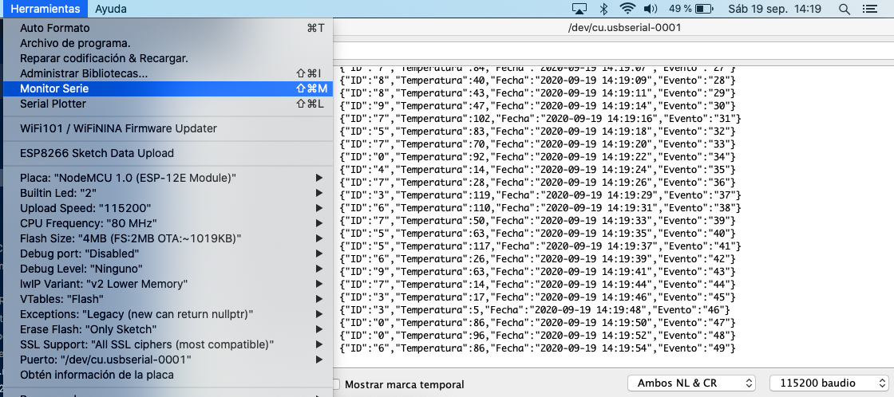

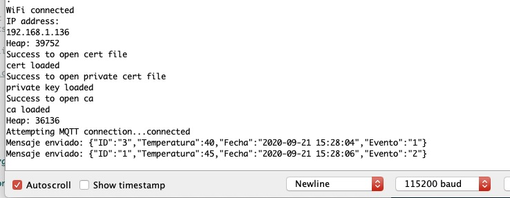


---
---

## Ejercicio 3: Manejo de mensajes IoT en AWS Cloud.

---

### Parte 1: Crear una tabla DynamoDB con mensajes MQTT desde AWS IoT Core

Primero que todo debemos crear una tabla en DynamoDB en la cual escriberemos los datos, para esto debemos ir al servicio con su nombre y darle click en **"Crear Tabla"**, para nuestro ejercicio la nombraremos **"iot-prueba"** para las Claves principales usaremos los datos que enviamos desde nuestro programa **ID** y **Fecha**.

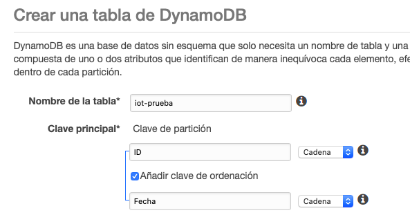

Asegurate que el contenido que envies sea "Cadena" = String al igual que la información en el json que envias de lo contrario no veras los datos en la dynamondDB.

Ahora debes crear la regla en AWS IoT Core, para eso ve al meno de abajo a la izquierda **Acto --> Regla** y dale al botón **Crear una Regla**


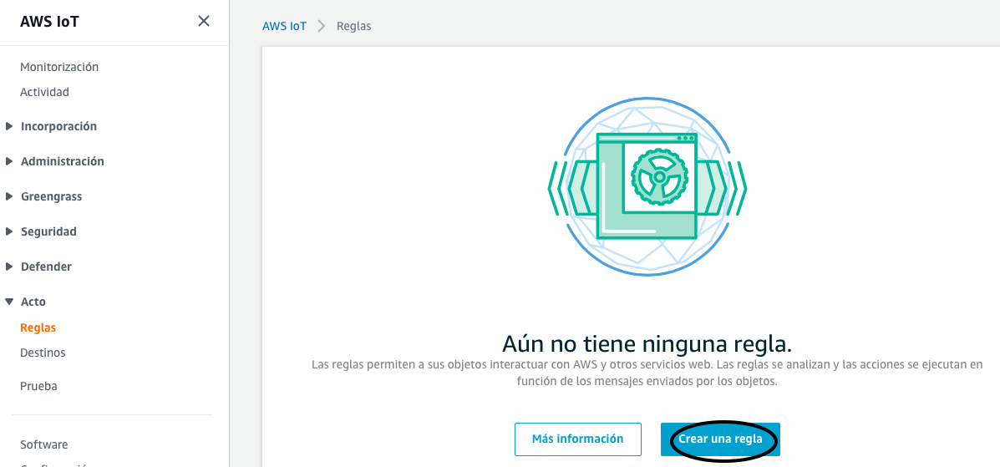

Debes llenar los campos: 
- Nombre: para nuestro ejercicio se llamara iotDynamoDB
- Descripción, no es un campo obligatorio pero es recomendable para que sepas que hace la regla. 
- Instrucción de consulta de regla, debes modificar la query a: 
```
SELECT * FROM 'data'
```
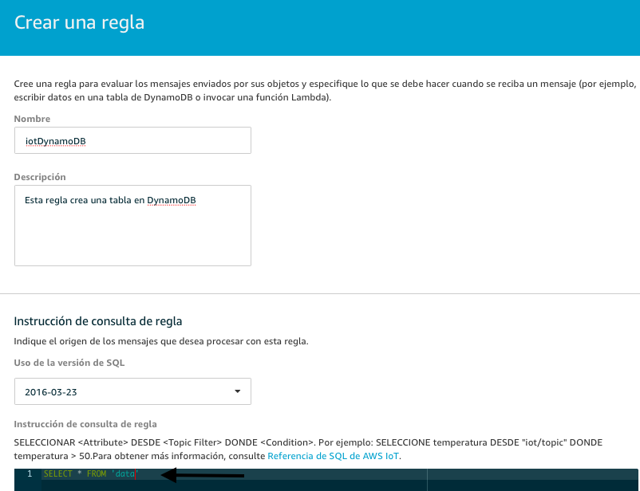

Paso siguiente en **Definir una o varias acciones**, le das al boto **Añadir Accion**, y seleccionas la segunda opcion corresponiente a DynamoDB.

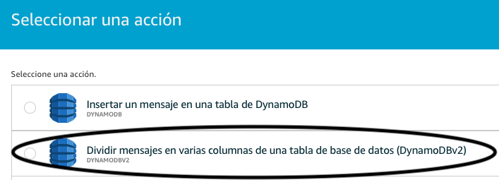

A continuacion debes configurar la accion y crearle un rol, en nombre de tabla selecciona la que creamos anteriormente y en rol selecciona **"Crear un rol"**. 

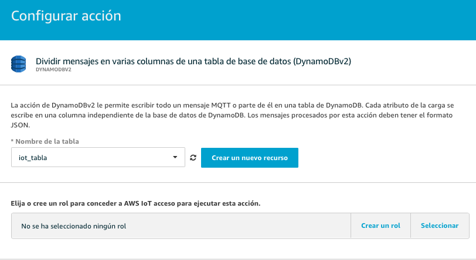

Nombre el rol y continua con **"Crear un rol"**


Finaliza con **Crear accion** y luego con **Crear Regla**

Una vez lista dale a los tres botones de la derecha --> **Habilitar**

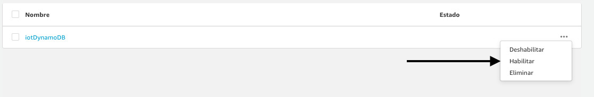

Ahora envia los datos y podras observar como la tabla de DynamoDB creada se empieza a llenar con los datos de tu objeto IoT.

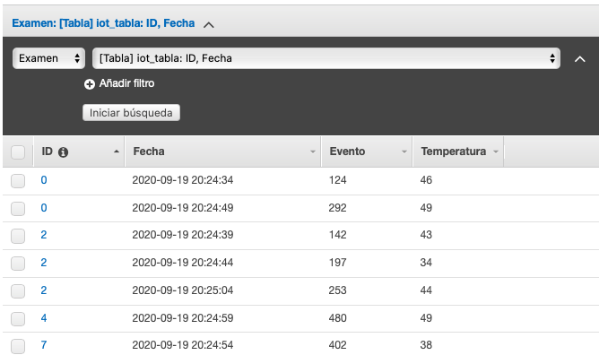

---

### Parte 2: Envió de notificaciones por SMS y correo electrónico.

Para el envio de notificaciones usaremos el servicio [AWS SNS](https://aws.amazon.com/es/sns/?whats-new-cards.sort-by=item.additionalFields.postDateTime&whats-new-cards.sort-order=desc). 


Para iniciar debemos crear un tema en AWS SNS


Lo nombras como quieras en mi caso lo deje como **SNSAlerta** y luego **Crear Tema**. 

A continuación dale click a **Crear una subcripción**, aca indicaremos el protocolo que enviara la notificación. 

Para el caso de SMS seleccionamos en protocolo SMS y agregas el numero al cual quieres que le lleguen las notificaciones y finalizas con **Crear Subscripción**:


Ahora vamos a crear una cola en SQS, esto para asegurar que no se nos quede ninguna notificación por fuera. 

Vamos al servicio [AWS SQS](https://aws.amazon.com/es/sqs/) y Creamos una cola. 


La nombras como **"ColaAlertaIot"** y para efecto de este ejercicio dejas el resto como esta y avanzas con **"Crear Cola"**. 

Subcribimos la cola al tema Amazon SNS

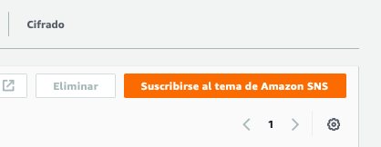

Y seleccionas el tema creado anteriormente

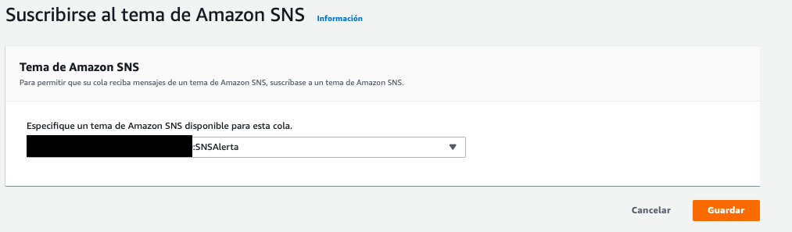

De vuelta a AWS IoT Core vamos al meno de abajo a la izquierda **Actuar --> Reglas --> Crear**

Creas la regla como se muestra en la imagen a continuación

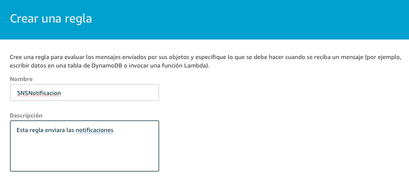

Y al igual que el erjecicio anterior modificamos la Query pero esta vez como se muestra a continuación: 

```
SELECT "Alerta: Temperatura mayor a 40 grados" as msg FROM 'data' where Temperatura > 40
```
Añadimos acción y seleccionamos:

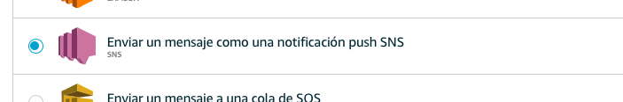

Configuramos la acción y en formato de mensaje seleccionamos RAW: 

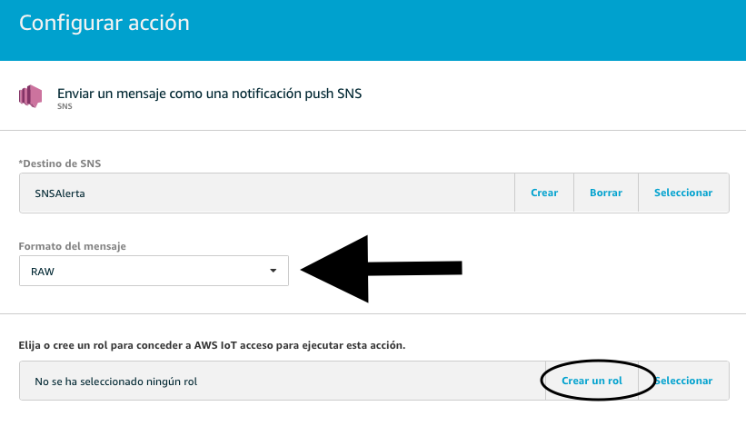

Como en el ejercicio anterior debemos crear el Rol

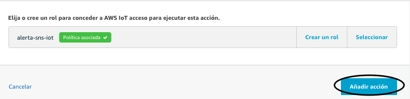

Y finalizamos con **Añadir Accion --> Crear Regla**

No olvides habilitar la regla. 

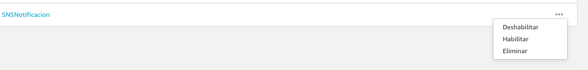

y envia tus notificaciones!! 

---
## Limpieza: 

Estos servicios no generan costos si se no se utilizan, pero por higiene y orden es recomendable borrarlos. 


