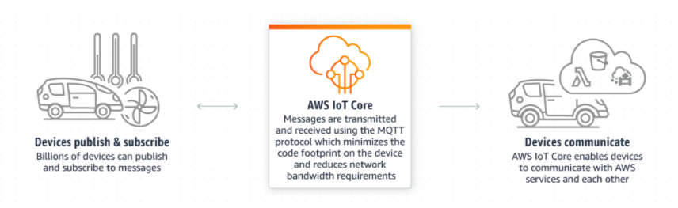

## Iniciando AWS IoT

En este repositorio vamos a aprender los primeros pasos para integrarnos a mundo de AWS IoT. 

Para conocer las ventajas y caracteristicas del mundo AWS IoT te inivito a visitar el siguiente link: [https://aws.amazon.com/es/iot/](https://aws.amazon.com/es/iot/)

Este tutorial consiste en dos ejercicios uno usando python y otro usando un NodeMCU ESP8266, en ambos trabajaremos en el servicio AWS IoT Core. 

** AWS IoT Core **

AWS IoT Core es un servicio en la nube administrado que permite a los dispositivos conectados interactuar de manera fácil y segura con las aplicaciones en la nube y otros dispositivos.

[Conoce más sobre AWS IoT Core](https://aws.amazon.com/es/iot-core/?nc=sn&loc=2&dn=3)

---

# Ejercicio 1:

¿Que necesito?

- Una cuenta AWS. [Crea tu cuenta con capa gratuita](https://aws.amazon.com/es/free/?all-free-tier.sort-by=item.additionalFields.SortRank&all-free-tier.sort-order=asc)
- Tener instalado un compilador de Python (Anaconda, Visual Studio Code, etc..)

  [Descargar Anaconda](https://www.anaconda.com/products/individual)
  
  [Descargar Visual Studio](https://code.visualstudio.com/download)

- Conocimientos en Python, para entender el código. 

