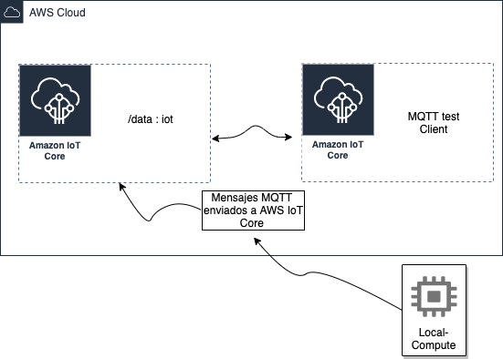
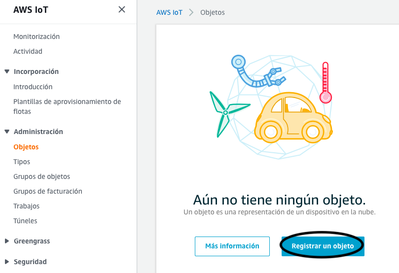
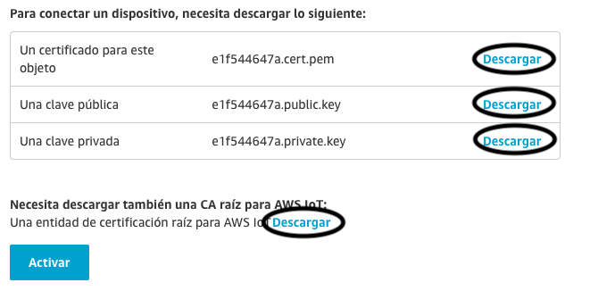

# Iniciando AWS IoT

En este repositorio vamos a aprender los primeros pasos para integrarnos a mundo de AWS IoT. 

Para conocer las ventajas y caracteristicas del mundo AWS IoT te inivito a visitar el siguiente link: [https://aws.amazon.com/es/iot/](https://aws.amazon.com/es/iot/)

Este tutorial consiste en dos ejercicios uno usando python y otro usando un NodeMCU ESP8266, en ambos trabajaremos en el servicio AWS IoT Core. 

---
---

## AWS IoT Core 

AWS IoT Core es un servicio en la nube administrado que permite a los dispositivos conectados interactuar de manera fácil y segura con las aplicaciones en la nube y otros dispositivos.

[Conoce más sobre AWS IoT Core](https://aws.amazon.com/es/iot-core/?nc=sn&loc=2&dn=3)

---
---

## Ejercicio 1: 

En este ejercicio, vamos a configurar un objeto de IoT en AWS IoT Core; una vez que tenga esa configuración, ejecutaremos un pequeño programa para simular el envío de datos a AWS IoT Core y luego usará el cliente de prueba MQTT para ver la carga útil de cada mensaje MQTT.

¿Que necesito?

- [x] Una cuenta AWS. [Crea tu cuenta con capa gratuita](https://aws.amazon.com/es/free/?all-free-tier.sort-by=item.additionalFields.SortRank&all-free-tier.sort-order=asc)
- [x] Conocimientos en Python.
- [x] Configurada tus credenciales de acceso de la cuenta AWS. [Aca como lo puedes hacer](https://docs.aws.amazon.com/es_es/cli/latest/userguide/install-cliv2.html)

---

### Parte 1: Crear el objeto en AWS IoT Core.

Ir al servicio AWS IoT Core

En el siguiente menú seleccionar Click a **"Crear solo un objeto"**

Para este ejercicio le colocaremos el nombre de **objeto1** y le damos Click a **"Siguiente"**

En el siguiente paso debes darle Click a **"Crear Certificado"**
 

Un certificado X.509 individual por dispositivo es la forma recomendada de interactuar con los servicios de AWS IoT desde los dispositivos, 
lo que ofrece la capacidad de grabar la clave privada en el dispositivo al momento de la inscripción que luego nunca se transfiere a través de Internet junto con las solicitudes, una ventaja de seguridad. 

 

 Descargue el certificado y la clave privada para el dispositivo, y también el rootCA 1 . 

- Modifica el nombre de tu certificado a **certificate.pem**
- Modifica el nombre de tu private key a **privateKey.pem**
- Modifica el nombre de tu rootCA 1 a **rootCA.pem**

 Asegúrese de presionar el botón de **"Activar"** para que se pueda usar el certificado. 

 

Finalice el proceso haciendo clic en el botón **"Listo"**. 

El siguiente punto es crear y adjuntar una política al certificado, que autorice al dispositivo autenticado a realizar acciones de IoT en los recursos de IoT.

Para crear la politica debes ir al menú del lado izquierdo **Seguridad -> Políticas** una vez ahí debes darle Click a **"Crear una Política"**, para efectos de este ejercicio la nombreremos **objeto1-policity**, complete los campos (Acción, ARN de recurso) con una estrella **"*"**, esto solo para efectos de este ejerccio ya que permite todo, y marque la opción Permitir efecto y luego presione el botón **"Crear"**.

Ahora en el menú del lado izquierdo **Seguridad -> Certificados**, verá el certificado que ha creado anteriormente, toque los tres puntos de la derecha y elija **Asociar política**, aparecerá una ventana emergente que muestra sus políticas existentes, verifique las recientes política que haya creado y asocie.

**¡¡Esto es todo Felicidades!! ya has creado tu primer objeto de AWS IoT con éxito, le has generado un certificado y le has adjuntado una política.**

---

### Parte 2: Simular dispositivo con programa en python.

Para esta parte debes descargar el siguiente programa [ejercicio1.py] en la misma carpeta donde tienes los certificados descargados y renombrados en la parte anterior. 

